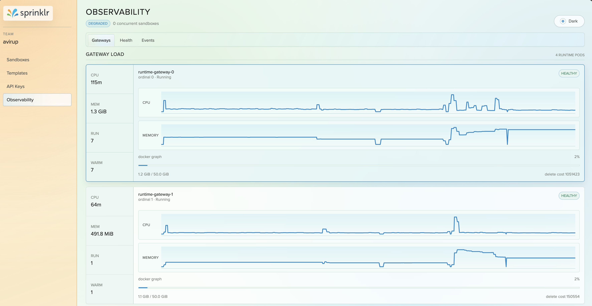
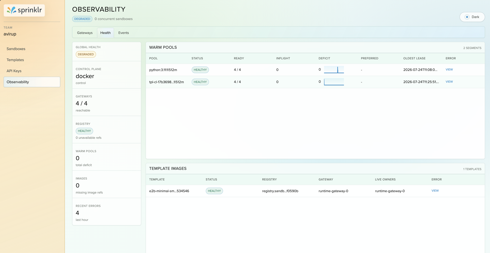
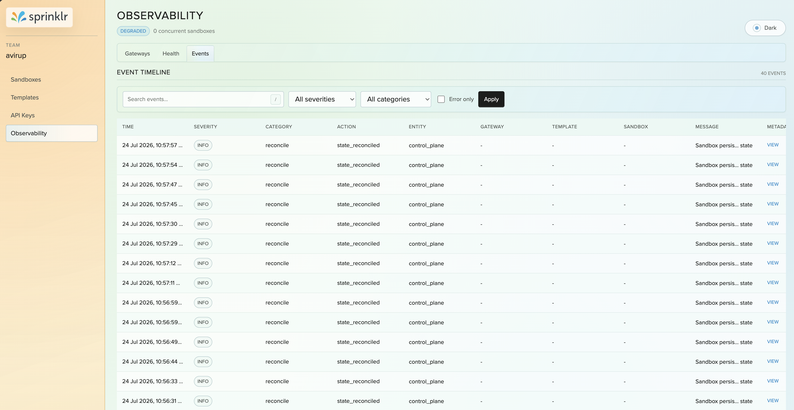

# Maintain Doc

All variables passed through the secret; variables marked "Required" must be present for successful bootup of the corresponding service.

## `agent-sandbox-tier1-secret`

| Key | Used by | Required / Optional (QA6) | Notes |
|---|---|---|---|
| `API_KEY` | api-service | **Required** | External/client API auth |
| `INTERNAL_API_KEY` | api-service, runtime-gateway | **Required** | Service-to-service auth |
| `ADMIN_API_KEY` | api-service | **Required** | Admin/portal operations |
| `AUTH_JWT_SECRET` | api-service | **Required** | JWT signing (≥32 chars if chart creates secret) |
| `PORTAL_SESSION_SECRET` | api-service | **Required** | Portal session cookies (≥32 chars if chart creates) |
| `DATABASE_URL` | api-service | **Required** | Postgres or Mongo connection |
| `DATABASE_TYPE` | api-service | **Required** | `postgres` or `mongo` |
| `DATABASE_USERNAME` | api-service | Optional | When creds are not embedded in `DATABASE_URL` |
| `DATABASE_PASSWORD` | api-service | Optional | When creds are not embedded in `DATABASE_URL` |
| `TEMPLATE_REGISTRY_USERNAME` | runtime-gateway, template-registry | Optional | Only if `templateRegistry.authRequired=true` |
| `TEMPLATE_REGISTRY_PASSWORD` | runtime-gateway, template-registry | Optional | Only if `templateRegistry.authRequired=true` |
| `IMAGE_BUILDING_S3_BUCKET` | api-service | Optional | Only if `imageBuilding.authRequired=true` |
| `IMAGE_BUILDING_S3_REGION` | api-service | Optional | Only if `imageBuilding.authRequired=true` |
| `IMAGE_BUILDING_S3_ACCESS_KEY_ID` | api-service | Optional | Only if `imageBuilding.authRequired=true` |
| `IMAGE_BUILDING_S3_SECRET_ACCESS_KEY` | api-service | Optional | Only if `imageBuilding.authRequired=true` |
| `IMAGE_BUILDING_S3_SESSION_TOKEN` | api-service | Optional | Only if `imageBuilding.authRequired=true` (always optional) |

## Portal observability

During registration or sign-in through the portal, use the same ADMIN_API_KEY passed during secret creation in the portal form to see the observability tab.

### Gateway pods

Here you can see information about the pods where the DinD containers exist, including current CPU used, memory used, and number of running sandboxes. Clicking on them shows more details about the sandboxes running inside them.

### warm pools & template images

Gives more control plane info including isolation currently supported "GVISOR and DOCKER". Information about warmpool state for each segment, how many have been filled, and what is the desired number of warmpool sandboxes. In the templates section you can see all the currently registered templates in the entire infra.

### Events

Logs all the information from both API side and gateway side, divided into modules like sandbox, warmpool to see module-specific logs.

